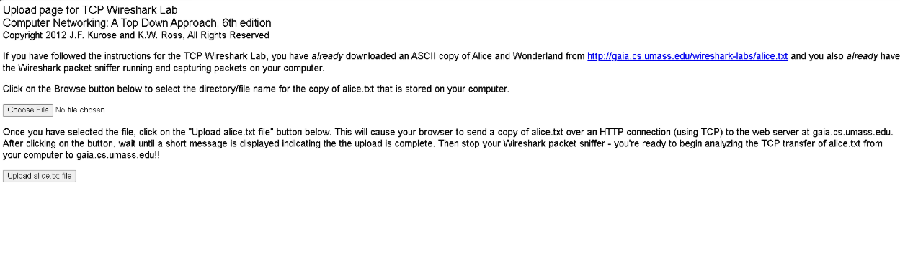
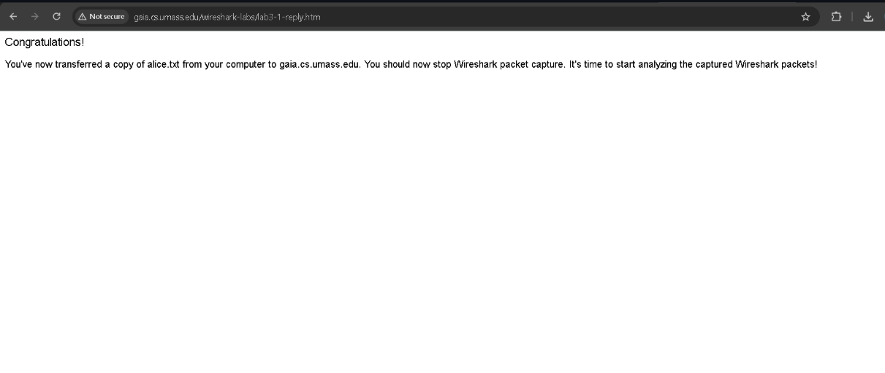
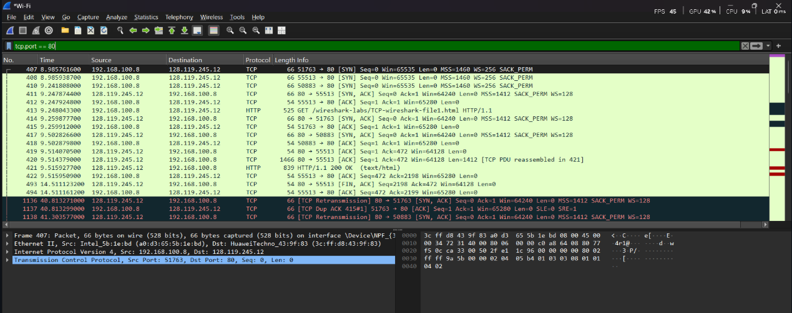
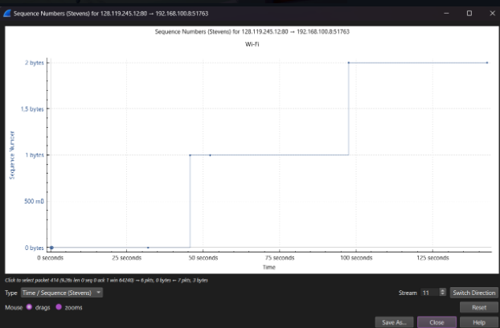

# Laporan Praktikum modul 6

# Tujuan

TCP

1. kita ke link http://gaia.cs.umass.edu/wireshark-labs/alice.txt. lalu tekan ctrl + s untuk save file alice.txt nya
2. buka wireshark dan mulai capture nya

3. buka link http://gaia.cs.umass.edu/wireshark-labs/TCP-wireshark-file1.html . lalu tekan upload alice.txt

4. stop capture diwireshark

5. filter dengan tcp.port == 80

# jawab soal I
1. alamat IP dan nomor port TCP yang digunakan oleh komputer klien? 56972
2. Apa alamat IP dari gaia.cs.umass.edu? Pada nomor port berapa ia mengirim dan menerima segmen TCP untuk koneksi ini? ip server = 128.119.245.12 , ip address pc = 10.122.2.146 , nomor port = 80

# TCP Congestion Control in Action
masuk ke statistic klik TCP Stream Graphs, lalu klik Time-Sequence (Stevens)

