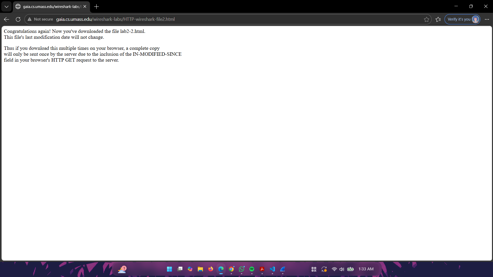
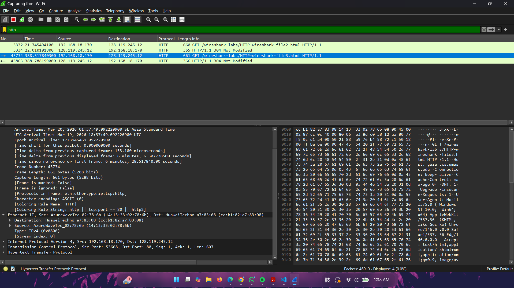

# laporan praktikum week 3 
# Nama : Putra Paramartha Suratinoyo 
# Kelas : IF-04-04
# Nim : 103072400022

Modul 3  mempelajari http 

## langkah percobaan

1. buka wireshark 
2. dan klik wifi agar wireshark berjalan 
3. habis itu pergi ke link ini http://gaia.cs.umass.edu/wireshark-labs/HTTPwireshark-file2.html
4. buka wireshark kembali dan ketik di bagian atas untuk nge filter http saja 
 
  

## Link 3 HTTP CONDITIONAL GET/response interaction
5. tempelkan link ini ke browser http://gaia.cs.umass.edu/wireshark-labs/HTTPwireshark-file3.html
6. capture pakai wireshark dan liat respon nya terus filter pakai http 

## Link 4 HTML Documents dengan Embedded Objects
6. lakukan seperti tadi di atas yaitu menempelkan link ini ke browser http://gaia.cs.umass.edu/wireshark-labs/HTTPwireshark-file4.html
7. capture pakai wireshark dan ketik http di bagian filter nya agar link di atas bisa ke capture sama  wireshark nya 

## Link 5  HTTP Authentication
6. Tempel Link ini http://gaia.cs.umass.edu/wiresharklabs/protected_pages/HTTP-wireshark-file5.html ke browser nanti kamu bakalan nge liat halaman login,terus masukan username dan password yang salah untuk mencoba skenario gagal nya 
7. setelah kita klik sign in nanti respon si web bakalan meminta kita untuk memasukan username dan passsword yang benar
 
8. buka wireshark kembali untuk nge capture link yang di tempelkan ke browser tersebut.habis itu filter pakai http
 
9. habis itu kita coba skenario yang benar yaitu memasukan password dan username yang benar yaitu  username: wireshark-students dan password: network,dan klik sign in
10. kita udah berhasil masuk dan liat respon dari web itu
 
11. buka wireshark kembali dan ketik http di bagian filter nya ketik http

 

## Link 