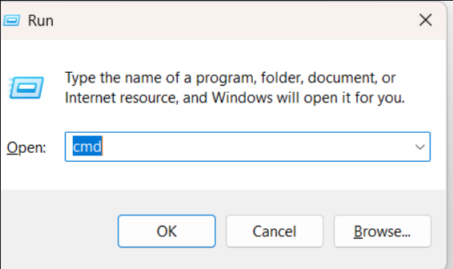
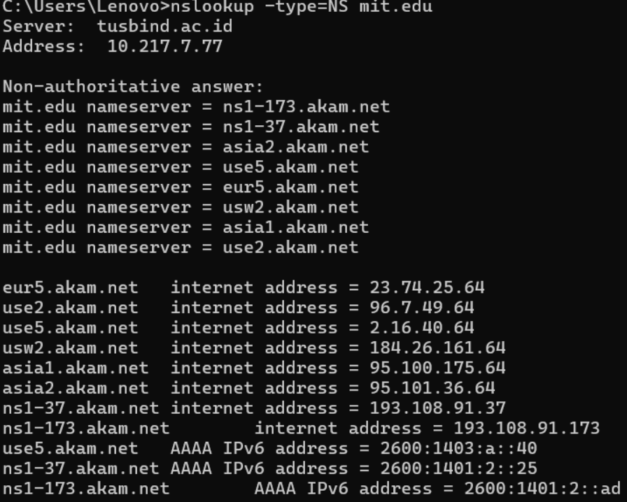

# Laporan Praktikum Modul 4 & 5

**Nama:** Putra Paramartha Suratinoyo 
**NIM:** 103072400022
**Kelas:** IF-04-04 
**Mata Kuliah:** Jaringan Komputer

---

## Modul 4: Investigasi DNS dengan Wireshark

### Tujuan
Mahasiswa dapat menginvestigasi cara kerja DNS menggunakan Wireshark.

### Ringkasan Percobaan
Praktikum ini melibatkan penggunaan perintah `nslookup` untuk berinteraksi dengan server DNS (root, otoritatif, dan perantara) serta melakukan analisis *tracing* paket DNS menggunakan Wireshark untuk memahami proses resolusi nama domain.

### Hasil Analisis (Wireshark)
* **Protokol:** Pesan DNS dikirim melalui UDP dengan ukuran 30 bytes.
* **Port:** Port tujuan pada permintaan DNS adalah 59962 dengan port sumber 53.
* **IP:** Alamat IP tujuan pada permintaan DNS adalah 10.217.7.77, yang merupakan server DNS lokal.
* **Cache:** Browser tidak selalu mengirim permintaan DNS baru untuk setiap elemen halaman web (seperti gambar) karena alamat IP yang sudah ditemukan akan disimpan di *cache*.

---

## Modul 5: Investigasi Protokol UDP

### Tujuan
Mahasiswa dapat menginvestigasi cara kerja protokol UDP menggunakan Wireshark.

### Analisis Header UDP
Berdasarkan hasil *trace* paket UDP, ditemukan informasi teknis sebagai berikut:

1. **Struktur Header:** Terdapat 4 *field* utama dalam header UDP: *Source Port* (4334), *Destination Port* (161), *Length* (58 byte), dan *Checksum* (0x65f8).
2. **Ukuran:** Setiap *field* memiliki panjang 2 bytes (16 bit), sehingga total panjang header adalah 8 bytes.
3. **Nilai Length:** Nilai *Length* merupakan total panjang header (8 bytes) + payload/data. Dengan *Length* sebesar 58 bytes, maka kapasitas data yang ditampung adalah 50 bytes.
4. **Kapasitas Maksimum:** Kapasitas maksimum payload UDP adalah 65.527 bytes (65.535 - 8 bytes header).
5. **Port & Protokol:** * Nomor port terbesar adalah 65.535 ($2^{16} - 1$).
    * Nomor protokol UDP dalam datagram IP adalah 17 (desimal) atau 0x11 (heksadesimal).
6. **Hubungan Paket:** Dalam pertukaran paket, *Source Port* pada paket pertama menjadi *Destination Port* pada paket balasan (sebaliknya).

---

## Visualisasi Konsep

